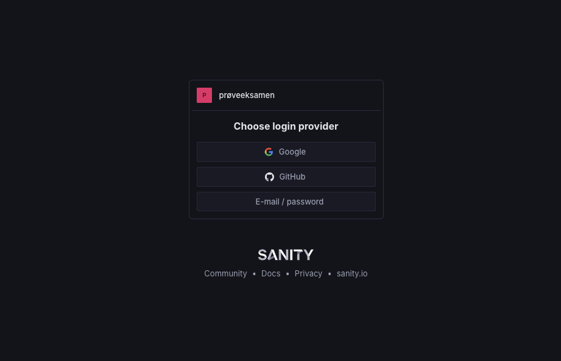
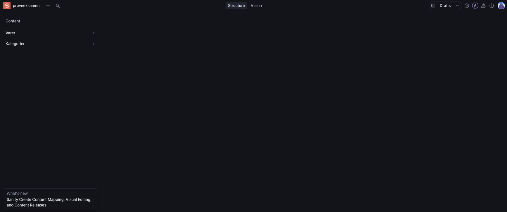
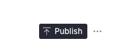

# Hvordan bruke Åses Musikk butikk databasen!!

Dette er en forklaring på hvordan man bruker Åses musikk butikk databasen.

## Hvordan finner man databasen?
For å gå inn på databasen må du besøke denne nettadressen: <https://proveeksamen.vercel.app>. Da skal du komme til en side som ser slik ut:

Logg deg inn med github. Hvis du har tilgang til databasen skal du se dette:

Hvis du ikke har tilgang til databasen må du få noen til å gi deg tilgang.

## Hvordan legger man til en vare i databasen
For å legge til en vare i databasen må du ha følgende informasjon om varen:
- Navn på varen
- Pris på varen
- hvilken kategori varen tilhører (for eks. Plate eller CD)
- Bilde av varen

Når du har all denne informasjonen så kan du trykke på **Varer** til venstre på siden. Nå skal en rad med alle varene stå til høyre for varene. Trykk på pluss tegnet helt øverst. 

Et skjema skal nå være på skjermen din. fyll ut skjemaet utfra informasjonen til varen og trykk på **Publish** helt nederst til høyre. 
